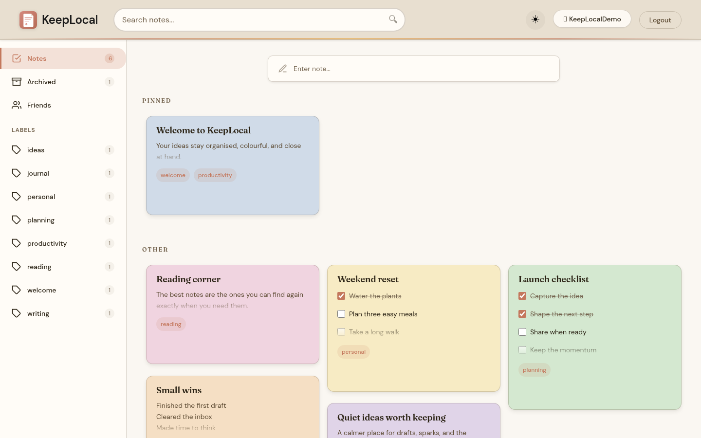
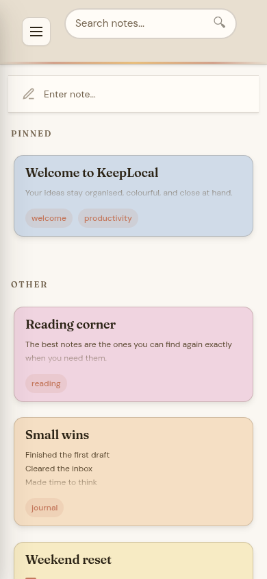
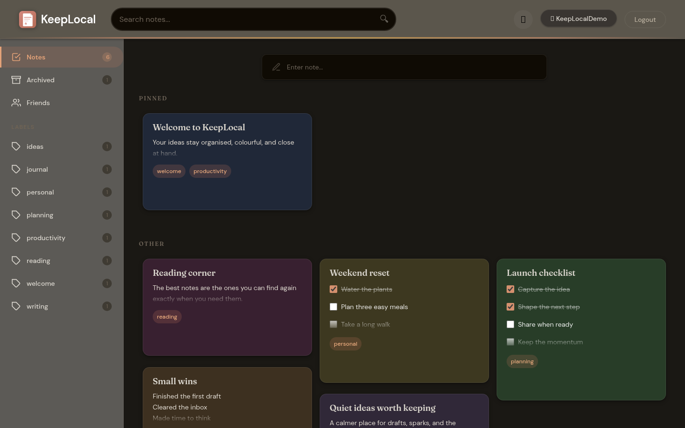
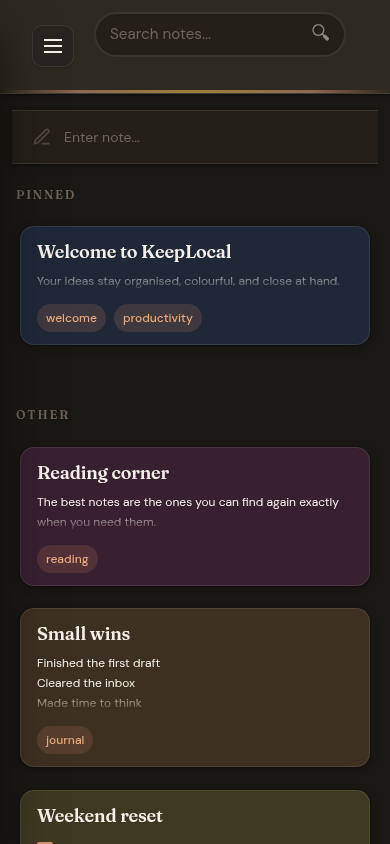
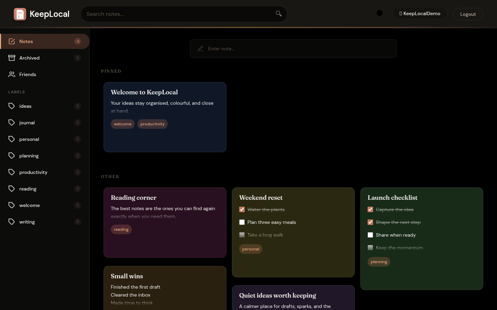
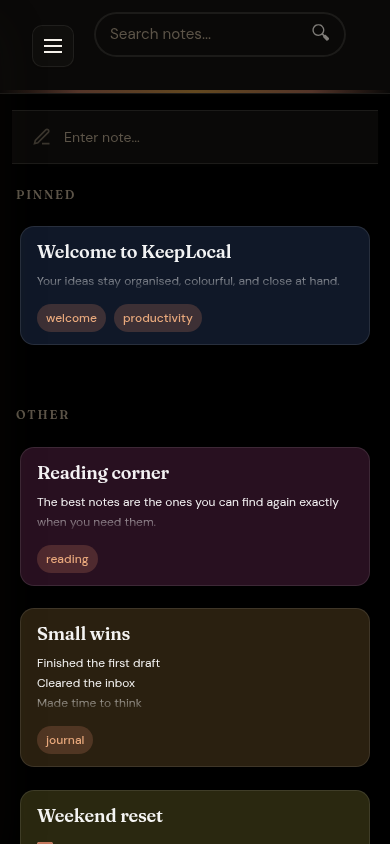
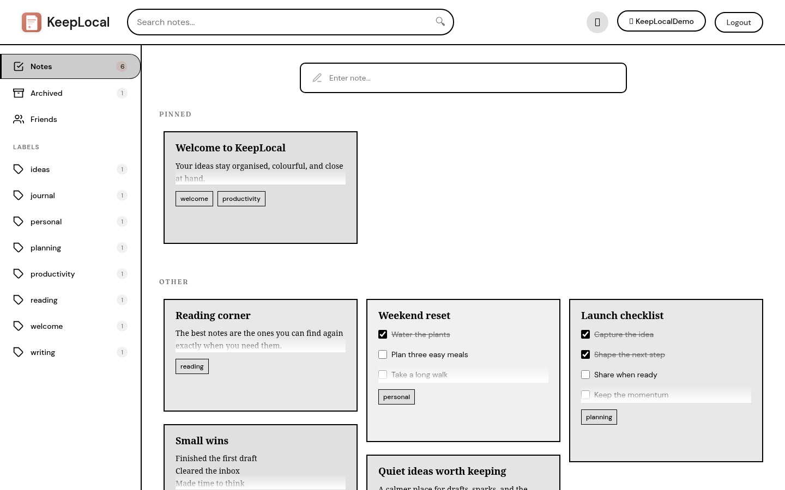
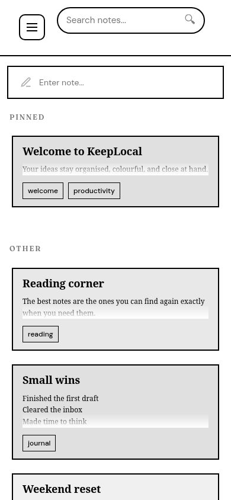
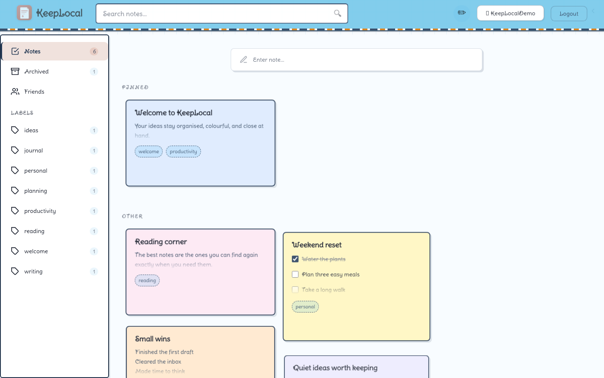
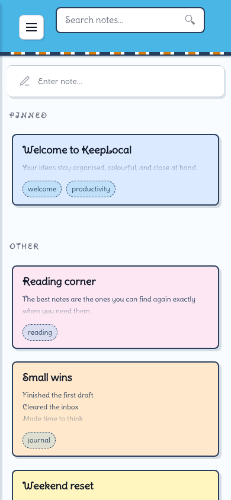

# KeepLocal 📝

A self-hosted notes application inspired by Google Keep. Create, edit, organize, and collaborate on your notes with an intuitive, feature-rich user interface.

## Screenshots

Each persistent theme is shown with the same representative notes on desktop and mobile.

### Light

<p align="center">
  
  
</p>

### Dark

<p align="center">
  
  
</p>

### OLED

<p align="center">
  
  
</p>

### E-Ink

<p align="center">
  
  
</p>

### Doodle

<p align="center">
  
  
</p>

## Features

### Core Note Features
- ✅ Create, edit, and delete notes with confirmation dialogs
- 🎨 12 different colors for your notes
- 📌 Pin/unpin notes for quick access
- 🏷️ Tags/labels for better organization with drag-and-drop support
- 🔍 Full-text search in title and content
- 📋 Todo lists/checklists within notes
- 🔗 Automatic link preview generation
- 📦 Archive notes (hide without deleting)
- 🎯 Drag and drop to organize and reorder notes

### Collaboration & Sharing
- 👥 Multi-user support with JWT authentication
- 🤝 Friend system with friend requests
- 🔄 Share and collaborate on notes with friends
- 👁️ Visual indicators showing who has access to shared notes
- 🔐 Granular sharing permissions

### User Experience
- 🌍 Internationalization (English & German)
- 🎨 Five persistent themes: Light, Dark, OLED, E-Ink, and Doodle
- 📱 Fully responsive design (works on desktop and mobile)
- 🚀 Fast and intuitive interface
- 🎯 Toast notifications for instant feedback
- ⌨️ Keyboard shortcuts for power users

### Security & Admin
- 🔒 Advanced security (XSS protection, CSRF tokens, CORS, Rate Limiting)
- 👨‍💼 Admin console for user management
- 🔐 User registration control (enable/disable)
- 📊 Statistics and usage analytics
- 💾 MongoDB database integration

### Deployment
- 🐳 Docker & Docker Compose support
- 📦 Unraid ready with templates
- 🔄 Easy updates and maintenance

## Technology Stack

### Frontend
- React 18 with Hooks (useState, useEffect, useContext, etc.)
- React Context API for state management (Auth, Language)
- Fetch-based API client with centralized cookie, CSRF, and error handling
- CSS3 with Grid Layout, Flexbox & CSS Variables for theming
- DOMPurify for XSS protection
- i18n with custom translation system
- Service Worker for offline capability

### Backend
- Node.js & Express.js
- MongoDB & Mongoose ODM
- JWT (JSON Web Tokens) for authentication
- bcrypt for password hashing
- Signed HMAC CSRF protection without server-side session state
- Helmet for security headers
- Express Rate Limit for DDoS protection
- XSS sanitization
- CORS with origin control
- HttpOnly cookie sessions with signed CSRF tokens

## Quick Start with Docker (Recommended)

The easiest way to run KeepLocal is using Docker Compose:

### Prerequisites
- Docker
- Docker Compose

### Installation

1. **Clone the repository**
   ```bash
   git clone https://github.com/zwaetschge/KeepLocal.git
   cd KeepLocal
   ```

2. **Create the production configuration**
   ```bash
   cp .env.example .env
   # Replace JWT_SECRET in .env with the output of:
   openssl rand -base64 48
   ```

3. **Start with Docker Compose**
   ```bash
   docker compose up -d --build
   ```

4. **Access the application**

   Open your browser and navigate to: `http://localhost:3000`

That's it! The application will automatically:
- Set up MongoDB
- Configure the backend server
- Build and serve the frontend
- Handle all networking between services

### Docker Commands

```bash
# Start the application
docker compose up -d

# Stop the application
docker compose down

# View logs
docker compose logs -f

# Restart services
docker compose restart

# Stop and remove all data (including database)
docker compose down -v
```

## Vercel Frontend Preview (Optional)

Vercel can build the React client as a static preview. Set the project **Root
Directory** to `client`; the checked-in `client/vercel.json` fixes the Vite
build command, output directory, and OAuth callback rewrite.

Use `VITE_API_URL` for the HTTPS origin of a separately deployed KeepLocal
server. Existing projects that still define `REACT_APP_API_URL` remain
compatible during migration, but `VITE_API_URL` takes precedence.

Vercel hosts only the browser client—not MongoDB, private uploads, or the
Whisper service. A functional deployment therefore also needs a reachable
backend, matching `ALLOWED_ORIGINS` and `CLIENT_URL`, and same-origin proxying
for cookie-based authentication. Keep Vercel as a protected visual preview if
that backend path is not configured; use the Docker deployment above for the
complete self-hosted application.

## Unraid Installation

### Method 1: Using Docker Compose (Recommended)

1. Install the **Docker Compose Manager** plugin from Community Applications
2. Create a new stack in Docker Compose Manager
3. Copy the contents of `docker-compose.yml` from this repository
4. Click "Compose Up"
5. Access via `http://[UNRAID-IP]:3000`

### Method 2: Using Unraid Templates

Choose between installing individual containers or using the compose stack:

**Option A: Individual Containers**

1. Go to **Docker** tab in Unraid
2. Click **Add Container**
3. Under **Template repositories**, add:
   ```
   https://github.com/zwaetschge/KeepLocal/tree/main/unraid
   ```
4. Install containers in this order:
   - **KeepLocal-MongoDB** (database)
   - **KeepLocal-Server** (backend API)
   - **KeepLocal-Client** (web interface)
5. Configure each container:
   - Update IP addresses in environment variables
   - Ensure ports don't conflict (27017, 5000, 3000)
   - Set MongoDB data path: `/mnt/user/appdata/keeplocal/mongodb`
6. Click **Apply** for each container

**Option B: Docker Compose Stack**

Use the template file at `unraid/keeplocal-compose.xml` with the Docker Compose Manager plugin.

For detailed instructions, see the [Unraid README](unraid/README.md).

### Unraid Configuration

After installation, you may need to update the CORS settings:

1. Go to Docker tab
2. Click on KeepLocal container
3. Edit the **ALLOWED_ORIGINS** variable
4. Add your Unraid server IP: `http://[UNRAID-IP]:3000`
5. Click **Apply**

## Manual Installation (Development)

### Prerequisites

- Node.js 22
- npm or yarn
- MongoDB (local or MongoDB Atlas)

### Setup

1. **Clone the repository**
   ```bash
   git clone https://github.com/zwaetschge/KeepLocal.git
   cd KeepLocal
   ```

2. **Configure MongoDB**

   Create a `.env` file in the `server/` directory:
   ```bash
   cd server
   cp .env.example .env
   ```

   Edit the `.env` file and set your MongoDB URI:
   ```env
   PORT=5000
   NODE_ENV=development
   MONGODB_URI=mongodb://localhost:27017/keeplocal
   ALLOWED_ORIGINS=http://localhost:3000
   ```

3. **Install and start the server**
   ```bash
   npm install
   npm start
   ```

   The server runs on: `http://localhost:5000`

4. **Install and start the client** (new terminal window)
   ```bash
   cd ../client
   npm install
   npm start
   ```

   The app opens automatically at: `http://localhost:3000`

## Usage

### First Time Setup
1. Access the application at `http://localhost:3000`
2. Create your admin account on the setup page
3. Log in with your credentials

### Creating a Note
1. Click on the input field "Take a note..." or click anywhere in the note form
2. Add a title (optional)
3. Enter your note content or create a todo list
4. Add tags (comma-separated) for organization
5. Select a color from the palette
6. Click "Save" or press `Ctrl+Enter`

### Editing a Note
1. Click on any note to open the edit modal
2. Edit the title, content, tags, or color
3. Switch between regular note and todo list mode
4. Click "Save" or press `Ctrl+Enter`

### Note Actions
- **Pin/Unpin**: Click the pin icon to keep notes at the top
- **Archive**: Click the archive icon to hide notes without deleting
- **Share**: Click the share icon to collaborate with friends
- **Delete**: Click the trash icon and confirm deletion

### Todo Lists
1. Click the checkbox icon when creating/editing a note
2. Add items to your todo list
3. Check items off as you complete them
4. Press `Enter` to add new items
5. Press `Backspace` on empty items to delete them

### Collaboration Features
1. **Add Friends**: Click "Freunde" (Friends) in the sidebar
2. **Send Requests**: Search for users and send friend requests
3. **Share Notes**: Click the share icon on any note
4. **Manage Access**: Add or remove collaborators
5. **View Shared Notes**: See avatar indicators on shared notes

### Searching & Filtering
- Use the search bar at the top for full-text search
- Click on tags in the sidebar to filter by category
- Drag tags onto notes to add them
- Click "Archiviert" to view archived notes

### Theme Customization
1. Click the theme toggle icon
2. Cycle through: Light → Dark → OLED → E-Ink → Doodle → Light
3. Your preference is automatically saved

### Language Selection
1. Click the language selector (🇩🇪/🇬🇧)
2. Choose between German and English
3. All UI text updates instantly

### Keyboard Shortcuts
- `Ctrl+N`: Focus on new note input
- `Ctrl+F`: Focus on search bar
- `Ctrl+K`: Toggle theme
- `Ctrl+Shift+L`: Logout
- `Ctrl+Enter`: Save note (in modal)
- `Esc`: Close modal

### Admin Features
1. Click on your username (admin only)
2. View statistics and user management
3. Create new users manually
4. Delete users or change admin status
5. Enable/disable user registration

## API Endpoints

### Authentication
- `GET /api/auth/setup-needed` - Check whether the first account is required
- `POST /api/auth/register` - Register new user (if enabled)
- `POST /api/auth/login` - User login (sets an HttpOnly session cookie)
- `POST /api/auth/logout` - Revoke the current session generation
- `GET /api/auth/me` - Get current user info
- `GET /api/csrf-token` - Get CSRF token

### Notes
- `GET /api/notes` - Get all notes (own + shared)
  - Query params: `search`, `tag`, `page`, `limit`, `archived`
- `GET /api/notes/:id` - Get single note
- `POST /api/notes` - Create new note
- `PUT /api/notes/:id` - Update note
- `DELETE /api/notes/:id` - Delete note
- `POST /api/notes/:id/pin` - Toggle pin status
- `POST /api/notes/:id/archive` - Toggle archive status
- `POST /api/notes/:id/share` - Share note with user
- `DELETE /api/notes/:id/share/:userId` - Unshare note

### Friends
- `GET /api/friends` - Get friends list
- `GET /api/friends/requests` - Get pending friend requests
- `POST /api/friends/request` - Send friend request
- `POST /api/friends/accept/:requestId` - Accept friend request
- `POST /api/friends/reject/:requestId` - Reject friend request
- `DELETE /api/friends/:friendId` - Remove friend
- `GET /api/friends/search` - Search users

### Admin
- `GET /api/admin/stats` - Get system statistics
- `GET /api/admin/users` - Get all users
- `POST /api/admin/users` - Create new user
- `DELETE /api/admin/users/:id` - Delete user
- `PATCH /api/admin/users/:id/admin` - Toggle admin status
- `GET /api/admin/settings` - Get system settings
- `PATCH /api/admin/settings` - Update system settings

### Link Previews
- `POST /api/notes/link-preview` - Fetch link preview data
  - JSON body: `{ "url": "https://example.com" }`

Browser endpoints use the HttpOnly session cookie and signed CSRF tokens. External
`/api/v1` endpoints use API keys and do not accept browser JWT bearer tokens.

## Project Structure

```
KeepLocal/
├── client/                          # React Frontend
│   ├── public/
│   │   ├── service-worker.js       # PWA Service Worker
│   │   └── manifest.json
│   ├── src/
│   │   ├── components/             # React Components
│   │   │   ├── AdminConsole.js     # Admin panel
│   │   │   ├── CollaborateModal.js # Note sharing UI
│   │   │   ├── ColorPicker.js      # Color selection
│   │   │   ├── ConfirmDialog.js    # Confirmation dialogs
│   │   │   ├── FriendsModal.js     # Friend management
│   │   │   ├── LanguageSelector.js # i18n switcher
│   │   │   ├── LinkPreview.js      # URL preview cards
│   │   │   ├── Login.js            # Login form
│   │   │   ├── Logo.js             # App logo
│   │   │   ├── Note.js             # Individual note card
│   │   │   ├── NoteForm.js         # New note input
│   │   │   ├── NoteList.js         # Notes grid
│   │   │   ├── NoteModal.js        # Note editor modal
│   │   │   ├── Register.js         # Registration form
│   │   │   ├── SearchBar.js        # Search input
│   │   │   ├── Setup.js            # Initial setup
│   │   │   ├── Sidebar.js          # Navigation sidebar
│   │   │   ├── ThemeToggle.js      # Theme switcher
│   │   │   └── Toast.js            # Notifications
│   │   ├── contexts/               # React Context
│   │   │   ├── AuthContext.js      # Authentication state
│   │   │   └── LanguageContext.js  # i18n state
│   │   ├── translations/           # i18n files
│   │   │   ├── de.js               # German translations
│   │   │   ├── en.js               # English translations
│   │   │   └── index.js
│   │   ├── utils/                  # Utility functions
│   │   │   ├── colorMapper.js      # Color theme mapping
│   │   │   └── sanitize.js         # XSS protection
│   │   ├── services/
│   │   │   └── api.js              # API client
│   │   ├── App.js
│   │   ├── App.css
│   │   └── index.js
│   ├── Dockerfile
│   ├── nginx.conf
│   └── package.json
│
├── server/                         # Express Backend
│   ├── config/
│   │   └── database.js            # MongoDB connection
│   ├── middleware/
│   │   ├── auth.js                # JWT authentication
│   │   ├── errorHandler.js        # Error handling
│   │   └── sanitizeInput.js       # Input sanitization
│   ├── models/
│   │   ├── Note.js                # Note schema
│   │   ├── Settings.js            # System settings schema
│   │   └── User.js                # User schema
│   ├── routes/
│   │   ├── admin.js               # Admin endpoints
│   │   ├── auth.js                # Authentication
│   │   ├── friends.js             # Friend management
│   │   ├── linkPreview.js         # Link previews
│   │   └── notes.js               # Note CRUD
│   ├── utils/
│   │   └── sanitize.js
│   ├── Dockerfile
│   ├── server.js
│   └── package.json
│
├── unraid/                        # Unraid templates
│   ├── keeplocal-compose.xml
│   └── README.md
├── docker-compose.yml             # Docker Compose config
├── .env.example                   # Environment template
├── .gitignore
└── README.md
```

## Development

### Running Server in Development Mode

```bash
cd server
npm run dev
```

Uses `nodemon` for automatic reloading on changes.

### Creating Production Build

```bash
cd client
npm run build
```

Creates an optimized production build in the `client/build/` directory.

## Security

KeepLocal implements multiple security layers:

- **Authentication**: Revocable JWT sessions stored only in HttpOnly cookies
- **Password Security**: bcrypt hashing with salt rounds
- **CSRF Protection**: Signed HMAC double-submit tokens with constant-time validation
- **XSS Protection**: Input sanitization on server and client (DOMPurify)
- **CORS Control**: Configurable allowed origins
- **Rate Limiting**: JSON errors, with a dedicated 20-attempt authentication limit
- **Security Headers**: Helmet.js for additional HTTP header security
- **Input Validation**: Mongoose schema validation on all inputs
- **Payload Limits**: Request size restrictions
- **Session Security**: HttpOnly, SameSite cookies with signed CSRF tokens
- **Database Injection**: Recursive input sanitization and explicit query construction

## Environment Variables

### Server Configuration

| Variable | Description | Default |
|----------|-------------|---------|
| `PORT` | Server port | `5000` |
| `HOST` | Server bind address | `0.0.0.0` |
| `NODE_ENV` | Environment mode | `development` |
| `MONGODB_URI` | MongoDB connection string | `mongodb://localhost:27017/keeplocal` |
| `ALLOWED_ORIGINS` | Comma-separated CORS origins | `http://localhost:3000` |
| `TRUST_PROXY` | Number of trusted reverse-proxy hops (`1` split, `2` all-in-one behind Traefik) | `false` |
| `JWT_SECRET` | Required JWT signing key, at least 32 characters | None |
| `CSRF_SECRET` | Optional CSRF signing key, at least 32 characters | `JWT_SECRET` |
| `COOKIE_SECURE` | Optional `true`/`false` override for automatic HTTPS cookie detection | Auto |
| `CLIENT_URL` | Explicit frontend origin for OAuth redirects | First allowed origin |
| `WHISPER_MODEL` | AI model for split deployments (`tiny`, `base`, `small`, ...) | `base` |

## Notes

- Notes are stored persistently in **MongoDB**
- The HTTP server starts only after MongoDB is connected and model indexes are ready
- The `.env` file contains sensitive configuration and should not be committed
- Production `ALLOWED_ORIGINS` must contain explicit origins; `*` is rejected
- For Docker deployments, MongoDB is automatically configured
- All data is stored in Docker volumes for persistence

## Troubleshooting

### Docker Issues

**Port already in use:**
```bash
# Change the port in docker-compose.yml
ports:
  - "8080:80"  # Use port 8080 instead of 3000
```

**Cannot connect to MongoDB:**
```bash
# Check if MongoDB container is running
docker compose ps

# View MongoDB logs
docker compose logs mongodb
```

**Reset everything:**
```bash
# Stop and remove all containers and volumes
docker compose down -v

# Start fresh
docker compose up -d
```

### Unraid Issues

**Cannot access WebUI:**
1. Check if the container is running
2. Verify port mapping in container settings
3. Update ALLOWED_ORIGINS with your Unraid IP
4. Check firewall settings

**Database not persisting:**
1. Ensure the appdata path is correctly configured
2. Check permissions on `/mnt/user/appdata/keeplocal/`

## Future Enhancements

- 🖼️ Image and file attachments in notes
- 🔄 Real-time synchronization with WebSockets
- 📤 Export/Import functionality (JSON, Markdown, PDF)
- 📱 Progressive Web App (PWA) improvements
- 🔔 Reminders & notifications
- 📧 Email notifications for shared notes
- 🔍 Advanced search filters (by date, color, collaborator)
- 🏷️ Nested tags/folders
- 📊 Note statistics and analytics
- 🎨 Custom color themes
- 🌐 Additional languages
- 🔗 Browser extensions (Chrome, Firefox)
- 📱 Native mobile apps (iOS/Android)
- 🔐 Two-factor authentication (2FA)
- 💬 Comments on shared notes
- 📝 Rich text editor with formatting

## Contributing

Contributions are welcome! Please feel free to submit a Pull Request.

1. Fork the repository
2. Create your feature branch (`git checkout -b feature/AmazingFeature`)
3. Commit your changes (`git commit -m 'Add some AmazingFeature'`)
4. Push to the branch (`git push origin feature/AmazingFeature`)
5. Open a Pull Request

## License

MIT License

## Author

Created with ❤️ and Claude Code

## Acknowledgments

- Inspired by Google Keep
- Built with React and Express
- MongoDB for data persistence
- Docker for easy deployment
