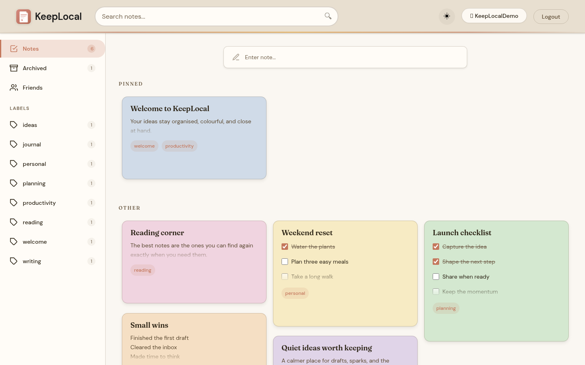
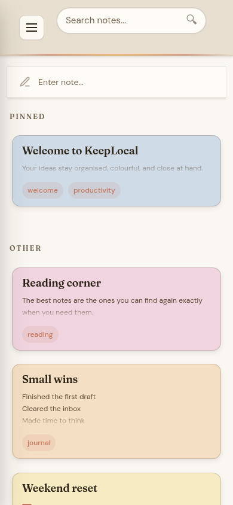
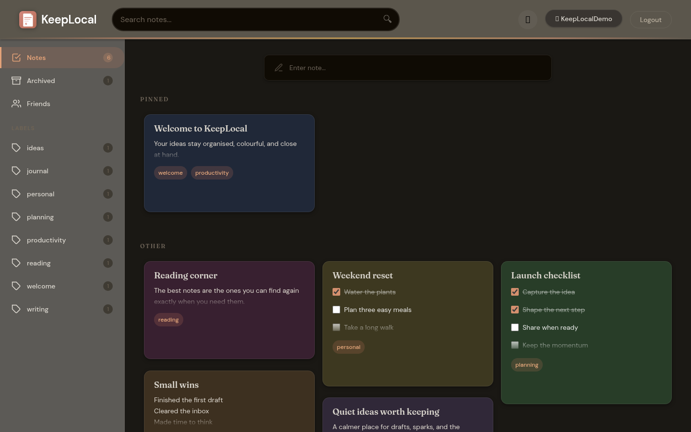
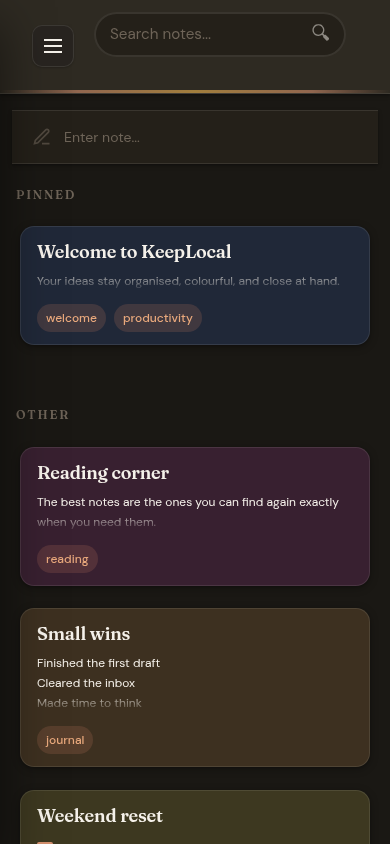
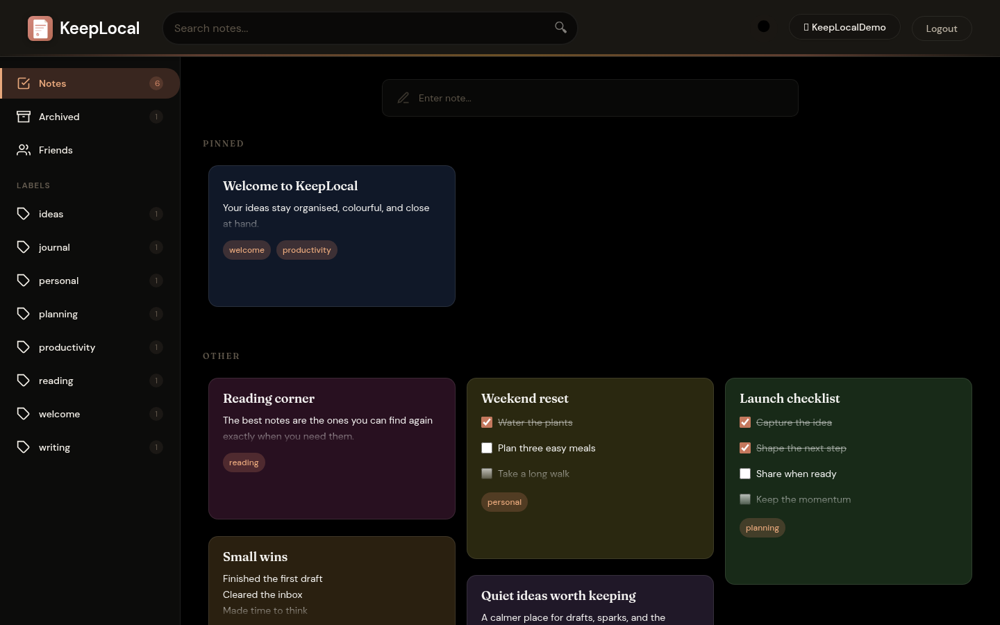
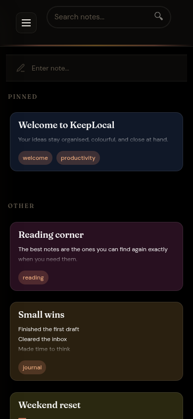
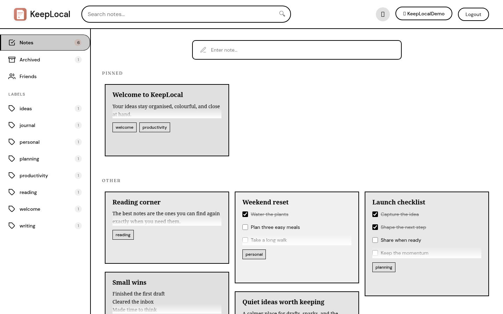
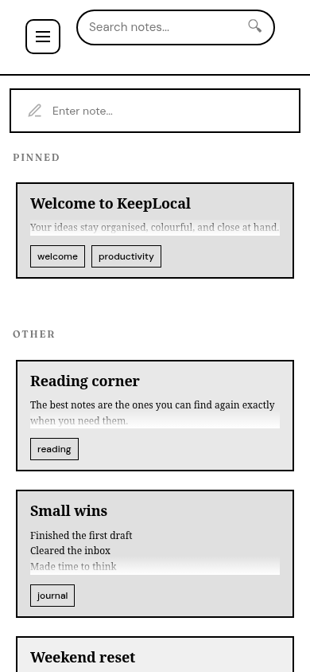
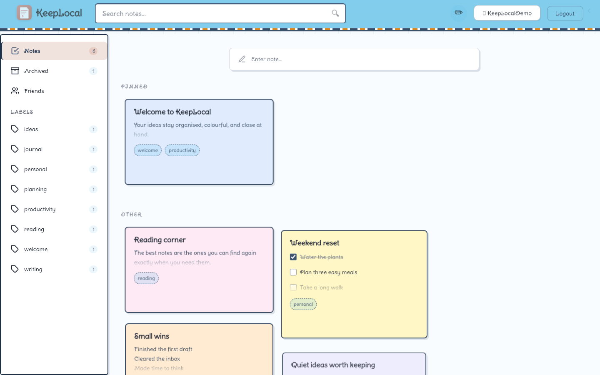
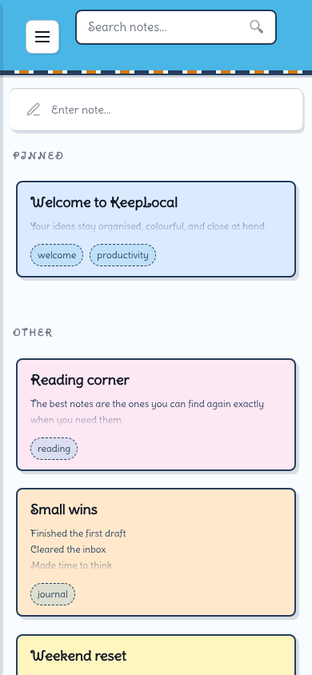

# KeepLocal

KeepLocal is a self-hosted, multi-user notes application inspired by Google
Keep. It combines notes, checklists, tags, colors, archives, private image
uploads, collaboration, API access, and optional local Whisper transcription in
a responsive progressive web app.

## Try the public demo

[Open KeepLocal](https://keep-local-silk.vercel.app/) and choose **Try demo** /
**Demo ausprobieren**. The demo needs no account or shared password.

The public sandbox is isolated from the maintainer's private KeepLocal data and
resets every six hours. Do not enter personal or confidential information.
Uploads, transcription, API keys, link previews, friends, and sharing are
disabled there.

If a browser is still running an old cached release, open the independent
[safe-update page](https://keep-local-silk.vercel.app/recover.html). It removes
only KeepLocal's service worker, app caches, and local display preferences;
account cookies and server-side notes are not changed.

## Screenshots

Each persistent theme is shown with the same representative notes on desktop
and mobile.

### Light

<p align="center">
  
  
</p>

### Dark

<p align="center">
  
  
</p>

### OLED

<p align="center">
  
  
</p>

### E-Ink

<p align="center">
  
  
</p>

### Doodle

<p align="center">
  
  
</p>

## Current capabilities

- Notes and checklists with colors, tags, pinning, archives, search, and
  pagination — search is relevance-ranked (weighted text index, title matches
  first), highlights its matches, and narrows the tag counts to the result set
- Trash with undo, restore, permanent delete, and a 30-day server-side retention
- Manual note ordering per section via drag & drop (persisted; new notes join on
  top once a section has been sorted, otherwise recency rules as before)
- Private image uploads and optional local audio transcription
- Friend requests and shared-note collaboration: collaborators edit content,
  tags, images and recordings; archiving, sharing and deleting stay with the
  owner. Notes show who edited them last, and an editor that is open while
  somebody else saves offers the conflict banner instead of silently
  overwriting.
- English and German interfaces with Light, Dark, OLED, E-Ink, and Doodle
  themes — theme, UI language, and AI preferences follow the **account**
  (`PUT /api/auth/preferences`), not the device; localStorage is only a cache
- Responsive desktop/mobile layout and installable PWA
- Admin-managed registration and user administration
- Self-service password change plus admin-generated one-time password reset
  tokens (no mail server required)
- HttpOnly cookie sessions, signed CSRF tokens, explicit CORS origins, rate
  limits, input validation, and authenticated upload delivery
- Swagger/OpenAPI documentation and API-key authenticated `/api/v1` endpoints
- Split-container and all-in-one Docker deployments for AMD64 and ARM64

## Quick start: Docker Compose

Requirements: Docker Engine with Docker Compose v2 and `openssl`.

```bash
git clone https://github.com/zwaetschge/KeepLocal.git
cd KeepLocal
cp .env.example .env
openssl rand -hex 48
```

Replace `JWT_SECRET` in `.env` with the generated value. For a separate CSRF
signing key, generate another value and set `CSRF_SECRET` too. Then validate and
start the four-service stack:

```bash
docker compose config
docker compose up -d --build
docker compose ps
```

Open <http://localhost:3000>. On an empty database, the setup screen creates
the single bootstrap administrator. Later registrations follow the policy set
in the admin console.

Useful commands:

```bash
docker compose logs -f
docker compose restart
docker compose down
```

`docker compose down -v` permanently removes the database and uploaded files.
Do not run it as an update or troubleshooting step.

## Deployment choices

| Target | Contract | Notes |
| --- | --- | --- |
| Standard Docker | `docker-compose.yml` | MongoDB, Whisper, API, and web client as separate services |
| Nginx Proxy Manager | `docker-compose.npm.yml` | Same split stack; only the client joins the external proxy network |
| All-in-one / Unraid | `Dockerfile.allinone`, `docker-compose.allinone.yml` | MongoDB, Whisper, API, and Nginx in one image |
| Public sandbox | `client/vercel.json`, `docker-compose.demo.yml` | Vercel client plus an isolated, restricted backend |

The published all-in-one image is `valentin2177/keeplocal`. GitHub Actions
builds and smoke-tests both AMD64 and ARM64 variants before a `main` release is
considered complete.

Detailed guides:

- [Docker builds, image tags, updates, and rollback](docs/docker.md)
- [Nginx Proxy Manager](docs/nginx-proxy-manager.md)
- [Unraid](docs/unraid.md)
- [CachyOS development and testing](docs/cachyos.md)
- [Public demo operations](docs/public-demo.md)
- [Current architecture](docs/architecture.md)
- [Security audit and migration notes](AUDIT_REPORT.md)

## Persistent data and upgrades

KeepLocal has two independent persistent data sets:

- MongoDB (`mongodb_data` or `/data/db`)
- Private uploads (`uploads_data`, `/app/uploads` in the split server, or
  `/app/server/uploads` in the all-in-one image)

Back up both before changing images or deployment layouts. Pull or build the
new image, recreate the services without deleting volumes, verify
`/api/health`, and keep the previous immutable image tag available for rollback.
The exact procedure is in [docs/docker.md](docs/docker.md).

### Index layout is repaired on startup

Indexes change between releases — for example `users.provider_1_providerId_1`
used to be a plain index and is now `unique` with a partial filter, and the note
text index gained weights. An existing index with the same name but different
options makes MongoDB reject `createIndex()`, which used to stop the server
before it ever listened on its port: the container crash-looped with
`An existing index has the same name as the requested index` although the data
was fine.

Startup therefore runs `syncIndexes()` per model: indexes that no longer match
the schema are dropped, the schema indexes are recreated, and every dropped
index is logged as `indexes synchronised`. Existing documents are untouched.
The all-in-one entrypoint additionally repairs ownership **recursively** — a
single root-owned file inside `/data/db` (for example left behind by maintenance
with `docker run -u root`) is enough to make `mongod` exit with code 14 forever
while the top-level directory still looks correct.

`npm run verify:upgrade-boot` (in `server/`) reproduces that upgrade: it seeds a
MongoDB with the July index layout, boots the real server and asserts the
indexes come back correctly. CI runs it against a real MongoDB on every push.

## Local development

Use Node.js 22 and MongoDB 7. A disposable local MongoDB can run in Docker:

```bash
docker run -d --name keeplocal-dev-mongodb -p 27017:27017 mongo:7-jammy
```

Start the API from `server/`:

```bash
cd server
npm ci
JWT_SECRET="$(openssl rand -hex 48)" \
MONGODB_URI="mongodb://localhost:27017/keeplocal" \
ALLOWED_ORIGINS="http://localhost:3000" \
npm run dev
```

In another terminal, start Vite from `client/`:

```bash
cd client
npm ci
npm run dev
```

Vite serves <http://localhost:3000> and proxies `/api` and `/uploads` to
<http://localhost:5000>.

## Verification

```bash
(cd server && npm test)
(cd client && npm test && npm run lint && npm run build)
(cd ai && python3 -m unittest test_app.py)

# Known vulnerabilities block CI as well (both trees must stay clean):
(cd server && npm audit --audit-level=high)
(cd client && npm audit --audit-level=high)

docker compose -f docker-compose.yml config
docker compose -f docker-compose.npm.yml config
docker compose -f docker-compose.allinone.yml config
```

### Dependency policy

CI runs `npm audit --audit-level=high` for both trees after `npm ci`, so a new
high advisory breaks the build instead of shipping. The upload path deserves
particular attention: `multer` parses attacker-controlled multipart data and
`sharp` decodes attacker-controlled pixels, which is why `multer >= 2.3.0` and
`sharp >= 0.35.4` are asserted by a test, and why `qs` is pinned through
`server/package.json` `overrides` (Express 4 still depends on a vulnerable
range).

When an advisory has no fix inside the current major, record it here with the
reason and the date instead of silencing the gate. Known backlog of major
upgrades — deliberately not done in a drive-by, each needs the E2E suite green
before and after: Express 4 → 5, mongoose 8 → 9, Helmet 7 → 8, React 18 → 19.
After a `sharp` or `multer` bump, re-run the image path once with real files
(`generateThumbnail`, `validateImageDimensions`, an upload through the editor).

### Upgrade boot check

Needs a reachable MongoDB and boots the real server once:

```bash
export UPGRADE_MONGODB_URI=mongodb://127.0.0.1:27017/keeplocal_upgrade
(cd server && npm run verify:upgrade-boot)
```

It drops that database (the name must contain `upgrade`, `e2e`, `test` or `ci`),
recreates the legacy index layout, waits for `/api/health/ready` and verifies
the repaired indexes plus the surviving documents.

The client uses Vite's `client/build/` output. The AI service's Python packages
are installed from `ai/requirements.txt`.

### End-to-end smoke suite

The unit suites never render the app, so a Playwright suite drives the real
production bundle in Chromium against the real server and MongoDB. It covers the
flows that broke silently in past audits: creating a note with `<`, `&` and a
link, closing the editor (crash regression), an image upload followed by a save
(false conflict), `Ctrl+N` while editing (duplicate regression), search, archive,
sharing with a collaborator who then edits, logout and login without a reload,
the mobile viewport, axe accessibility on the main screens, and the
`guard.js` → `recover.html` handoff for a broken deploy.

```bash
# A MongoDB must be reachable; the suite drops that database on every run.
export E2E_MONGODB_URI=mongodb://127.0.0.1:27017/keeplocal_e2e
(cd client && npx playwright install --with-deps chromium)   # once per machine
(cd client && npm run test:e2e)
```

`npm run test:e2e` builds the client, resets the E2E database (the script refuses
to drop a database whose name does not contain `e2e`, `test` or `ci`), starts the
API server plus a static server for `client/build`, and runs the suite. Set
`PLAYWRIGHT_CHROMIUM_PATH` to use a system Chromium instead of a downloaded one,
and `E2E_API_PORT`/`E2E_WEB_PORT` (defaults 5000/4173) when those ports are busy.

## API

When the API is running, interactive documentation is available at
`/api/docs`, and the OpenAPI document is available at `/api/docs.json`.

- Browser routes use the HttpOnly session cookie and a signed CSRF token.
- External `/api/v1` routes use API keys and do not accept browser bearer
  tokens.
- Private `/uploads` requests require an authenticated user with access to the
  owning note.
- `GET /api/notes?search=…` ranks by the weighted text index
  (`title:5, todoItems.text:2, content:1`, `default_language: none`) and returns a
  `score`; without a search the list stays ordered by pin, manual order and
  recency. Upgrading from an older release replaces the previous unweighted text
  index automatically at startup (`server/config/indexMigration.js`), because
  MongoDB allows only one text index per collection.
- `PATCH /api/notes/reorder` with `{ "orderedIds": [...] }` persists a manual
  order for one section (owner-only, max 200 ids). The server re-deals the
  existing `order` values of exactly those notes, so a page-local reorder cannot
  scramble other pages.
- `DELETE /api/notes/:id` moves a note to the trash (30-day TTL index, image
  files stay until it is purged). `POST /api/notes/:id/restore` brings it back,
  `DELETE /api/notes/:id?permanent=true` removes a trashed note for good, and
  `DELETE /api/notes/trash` empties it. `GET /api/notes?deleted=true` lists the
  trash; every other listing, count, tag aggregate and single-note lookup
  excludes trashed notes.
- Every error response carries a stable machine-readable `code` next to the
  human-readable `error` text (`server/constants/errorCodes.js`). Browser clients
  translate the code (`client/src/utils/apiErrors.mjs` plus the `err*` catalog
  keys) and keep the text as a fallback, so the German prose never leaks into an
  English UI; `/api/v1` consumers should branch on `code`, not on the message.

### Passwords

Self-hosted KeepLocal has no mail delivery, so password recovery works with
one-time tokens instead of e-mail links:

- **Change your own password**: Settings → Password (`POST
  /api/auth/change-password`, requires the current password). The server bumps
  the session version, so every *other* device is signed out while the current
  session receives a fresh cookie.
- **Reset somebody else's password**: Admin console → Users → *Reset password*
  (`POST /api/admin/users/:id/password-reset`) shows a token **once**. Hand it to
  that person; they redeem it on the login screen under *Forgot password?*
  (`POST /api/auth/reset-password`). Tokens are stored as SHA-256 hashes, expire
  after 15 minutes, are single-use, and invalidate all sessions of that account.

Both endpoints sit behind the auth rate limiter and enforce the same password
rules as registration (8–128 characters with upper, lower, and digit). Accounts
that sign in through OAuth have no local password and cannot use
`change-password`; an administrator can still issue a reset token, which sets a
local password alongside the OAuth identity.

Because reset tokens are admin-only and there is no mail delivery, an instance
without an administrator cannot recover itself through the UI. The API therefore
refuses to revoke the last administrator (`409` with code `LAST_ADMIN`, both for
the admin toggle and for deleting an admin account), and revoking admin rights
also releases the unique `single_bootstrap_admin` slot. If you inherit a database
that already lost its admin, use the recovery tool:

```bash
# All-in-one container
docker exec keeplocal node /app/server/scripts/promote-admin.js you@example.com

# Split server container / local checkout
cd server && MONGODB_URI=mongodb://127.0.0.1:27017/keeplocal \
  node scripts/promote-admin.js you@example.com --dry-run
```

It looks the account up by e-mail or username, prints what it found, and sets
`isAdmin` (never anything else — no passwords, no tokens). Rights apply from the
next request on; no re-login is needed.

## Important environment variables

| Variable | Purpose | Default |
| --- | --- | --- |
| `MONGODB_URI` | MongoDB connection string | Deployment-specific |
| `JWT_SECRET` | Required session signing key, minimum 32 characters | None |
| `CSRF_SECRET` | Optional independent CSRF signing key | `JWT_SECRET` |
| `ALLOWED_ORIGINS` | Exact comma-separated browser origins | `http://localhost:3000` |
| `CLIENT_URL` | Explicit frontend origin for OAuth redirects | First allowed origin |
| `COOKIE_SECURE` | Optional `true`/`false` override | Detected from HTTPS |
| `TRUST_PROXY` | Trusted reverse-proxy hop count | `1` standard / `2` NPM and public demo |
| `WHISPER_MODEL` | Bundled transcription model | `base` split / `tiny` all-in-one |
| `LINK_PREVIEW_LIMIT_PER_MINUTE` | Link previews per user and minute | `30` |
| `TRANSCRIPTION_LIMIT_PER_HOUR` | Transcriptions per user and hour | `10` |
| `TRANSCRIPTION_LIMIT_PER_DAY` | Transcriptions per user and day | `60` |
| `MAX_CONCURRENT_TRANSCRIPTIONS` | Parallel Whisper jobs before answering 429 — keep equal to gunicorn's `--workers` | `1` |
| `AI_SERVICE_TOKEN` | Shared bearer secret between the API server and the Whisper service (`/transcribe`) | generated per container start in the all-in-one image; **must** be set in split deployments |
| `LOG_FORMAT`, `LOG_LEVEL` | `json` for structured logs; `error`/`warn`/`info`/`debug` | `text`, `info` |
| `REQUIRE_AI_FOR_READY` | Make an unreachable AI service fail `/api/health/ready` | `false` |
| `HEALTH_DETAILS`, `HEALTH_PROBE_TTL_MS` | Show internal paths/driver errors on `/api/health/ready`; cache window for the upload and AI probes | details off in production, `30000` |
| `BACKUP_DIR`, `UPLOADS_DIR` | Recovery points and the uploads **root** (contains `images/` and `temp/`). Resolved by `server/config/paths.js` for the app, the readiness probe and `scripts/backup.js` alike — mount both on volumes | `server/backups`, `server/uploads` |
| `TRASH_RETENTION_DAYS`, `STORAGE_JANITOR_INTERVAL_HOURS` | Trash retention the janitor enforces (files first, then documents); janitor interval, `0` disables it | `30`, `6` |
| `GOOGLE_*`, `GITHUB_*` | Optional OAuth credentials and callbacks | Disabled when empty |

Production rejects wildcard CORS origins. Never commit `.env`, tokens, OAuth
secrets, database dumps, or uploaded user files.

The four limits above are per **user** (not per IP, which a reverse proxy would
collapse into one) and are counted in memory, i.e. per server process. Refused
requests answer `429` with a `Retry-After` header and a stable `code`
(`LINK_PREVIEW_RATE_LIMITED`, `TRANSCRIPTION_RATE_LIMITED`,
`TRANSCRIPTION_DAILY_LIMIT`, `TRANSCRIPTION_BUSY`) that the UI translates. Link
previews are additionally cached for 15 minutes per URL
(`X-Preview-Cache: hit|miss`), which is what makes reopening a note with a link
instant instead of another outbound fetch.

## Backup and observability

```bash
# One recovery point: every collection as type-preserving NDJSON, the uploads,
# and a SHA-256 manifest. Needs no mongodump, so it also runs in the server image.
(cd server && MONGODB_URI=mongodb://localhost:27017/keeplocal node scripts/backup.js --keep 7)
(cd server && node scripts/backup.js --list)
(cd server && node scripts/backup.js --verify backups/keeplocal-YYYYMMDD-HHMMSS-XXXXXX)
(cd server && node scripts/backup.js --restore backups/keeplocal-YYYYMMDD-HHMMSS-XXXXXX --force)
```

A backup is only reported as written when every image the database references was
captured (per-file size and SHA-256 in the manifest) — a wrong `UPLOADS_DIR`
fails loudly instead of producing an image-less recovery point. Restore verifies
the whole recovery point **before** the first `deleteMany`, inserts with
`ordered: false`, re-checks document counts against the manifest and checksums
the copied files; `--force` is still required. `npm run verify:backup-restore`
runs that round trip against a throwaway MongoDB, and CI runs it on every push.
See `docs/docker.md` for the container variants, the volume requirement and the
cron/scheduling notes.

Health: `/api/health/live` (process up), `/api/health/ready` (real database ping,
writable uploads, optional AI probe) and `/api/health` (legacy shape). The compose
healthchecks use the readiness endpoint, so a container no longer reports healthy
while writes are broken.

Logging: `LOG_FORMAT=json` emits one JSON object per line, `LOG_LEVEL`
(`error`|`warn`|`info`|`debug`) filters, and every request carries an
`X-Request-Id` (a sane incoming id from your proxy is reused). The id appears in
error responses and is forwarded to the AI service, so one failed transcription
can be followed through both logs. Cookies, authorization headers, CSRF tokens,
API keys and password fields are redacted in every log line.

## Repository layout

```text
client/                 React 18, Vite 8, Nginx, PWA, regression tests
server/                 Express API, MongoDB models, services, security tests
ai/                     Flask/Gunicorn faster-whisper service
assets/screenshots/     README desktop and mobile captures
docs/                   Current deployment and architecture guides
unraid/                 Unraid template notes
.github/                Multi-architecture Docker publication workflow
docker-compose*.yml     Supported runtime contracts
Dockerfile.allinone     Published all-in-one image
unraid-template.xml     Canonical Unraid container template
```

Historical implementation reports were removed from the working tree because
they described superseded token storage, CSRF middleware, file paths, and open
findings as if they were current. Their original text remains available in Git
history; the current security baseline is documented in `AUDIT_REPORT.md`.

## Contributing

Create a focused branch, include tests for behavior changes, run the relevant
verification commands above, and open a pull request against `main`. Do not add
generated builds, local environment files, screenshots containing private
notes, or runtime uploads.
